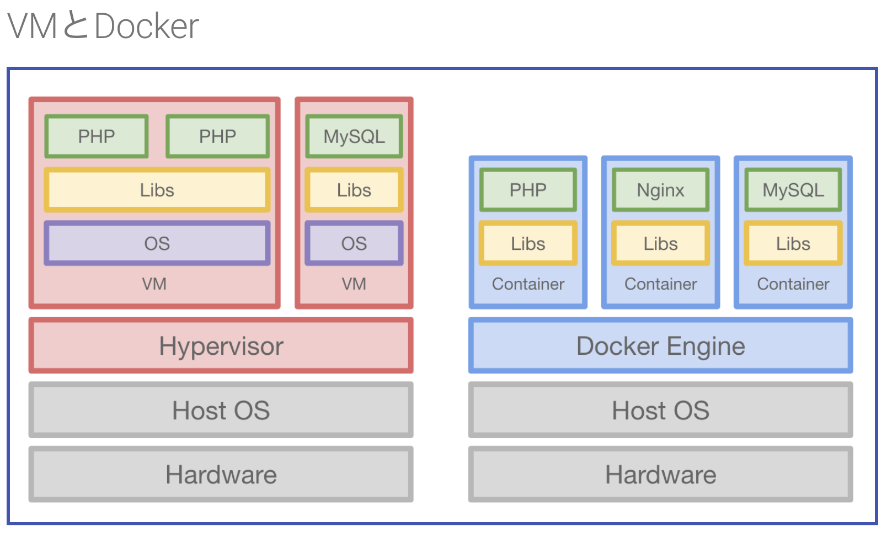
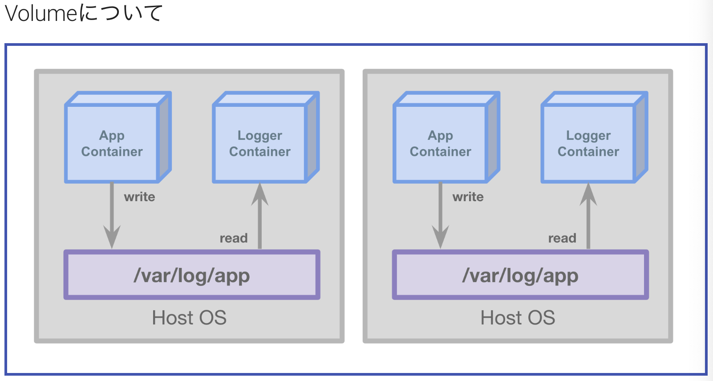

# Index

```
1. はじめに
2. コンポーネント
3. プロダクションでの活用
4. Tips
```


# はじめに

## Dcokerとは

- 利点
  - ポータビリティ
  - オーバーヘッド（VMと比較して）
  - スナップショットとIaC (Dockerfile, Image)
    - スナップショット（Gitでも出てきた言葉）

## VMとDocker



- VM: マシンの仮想化
- Docker: プロセスの仮想化　→より軽量


## Hello Docker!

起動の確認


# コンポーネント

## image

- Imageは環境のスナップショット
- Docker Hubから公式のImageを入手　→　ベースイメージとしてそれらを拡張していく（IaC, Dockerfileで）
- スナップショットとはそういうことか！

## dockerfile

- コマンドが17種類しかない（しかもよく使うのは7つ程度）ということを知って衝撃を受けた
- なら使えるようになるのも早そう...？


## container

- コンテナ内の各プロセスは、他所とは隔離されている
- フォアグラウンドでコマンドが終了したらコンテナは停止する
  - たとえば`echo "Hello World!"`させた時と`-d nginx`させた時では、コンテナの生存時間が異なるということか
  - でもバックグラウンドで起動した、フォアグラウンドで動かすnginxが停止したら、そのコンテナは停止してしまう（ややこしい）


## network

- Dockerではネットワークの扱いが重要
- プロセス間の通信はソケットではなくネットワークで
  - [ソケット通信とHTTP通信](https://www.miraclejob.com/recommend/detail?cd=2521#:~:text=HTTP%E3%81%AF%E3%82%AF%E3%83%A9%E3%82%A4%E3%82%A2%E3%83%B3%E3%83%88%E3%81%8C%E3%83%AA%E3%82%AF%E3%82%A8%E3%82%B9%E3%83%88,%E3%81%99%E3%82%8B%E3%81%93%E3%81%A8%E3%81%8C%E5%8F%AF%E8%83%BD%E3%81%A7%E3%81%99%E3%80%82)
    - コネクションの確立→双方向のやり取り
- 同一ネットワーク（Bridge）内のコンテナ同士だと通信できる
- 異なるネットワーク（Bridge）同士では設定なしに通信はできない
- ネットワークは作れる

## volume



- コンテナとは異なる独立したライフサイクル
  - Volumeはコンテナの外側へファイルが保管される
- 異なるコンテナ同士で共有が可能
- ただし、基本的には使用しないことが好ましい（エフェメラル）


# プロダクションでの活用

## 設計

## セキュリティ

## デバッグ

## イメージの仕組み

## Dockerfileのベストプラクティス

## オーケストレーションツール

## docker-compose

## プロダクションへの導入


# Tips

## tools

## docker-compose

## 参考書
